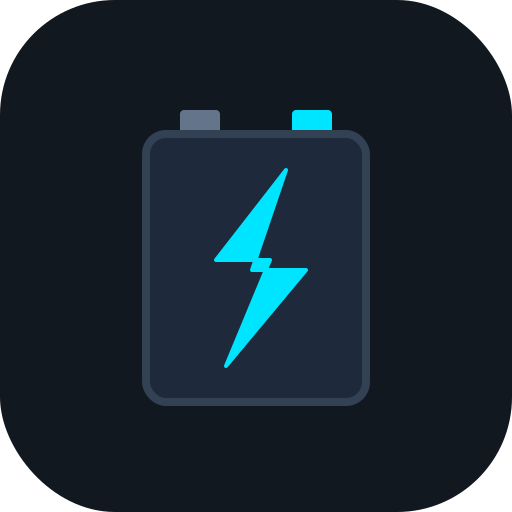

# Ström Monitor

<p align="center">
  
</p>

<p align="center">
  <strong>Modern BLE telemetry & battery monitor for JBD LiFePO4 Battery Management Systems.</strong><br>
  <code>de.karoc.strommonitor</code>
</p>

<p align="center">
  <a href="https://www.gnu.org/licenses/gpl-3.0"></a>
  <a href="https://flutter.dev"></a>
  <a href="https://dart.dev"></a>
  <a href="https://developer.android.com"></a>
</p>

An open-source, lightweight, and battery-conscious Android application built with **Flutter** to monitor, record, and visualize telemetry from **JBD (Xiaoxiang / Liontron)** LiFePO4 Battery Management Systems (BMS) and **Victron SmartSolar / BlueSolar MPPT** charge controllers over **Bluetooth Low Energy (BLE)**.

---

## ⚡ Features

* **Real-time Dual-Tile Dashboard (Pure Measured Telemetry):**
  * **Tile 1: Battery (JBD BMS):**
    * Interactive State of Charge (SoC %) arc gauge with dynamic color indicators (Charging, Discharging, Standby).
    * High-precision readouts: Total Pack Voltage ($V$), Current Draw/Charge ($A$), Power ($W = U \cdot I$), and Capacity ($Ah$).
    * 4S Individual Cell Voltage breakdown with delta ($\Delta V$) imbalance warning in millivolts.
    * Thermal monitoring (BMS NTC sensor and Battery Cell temperature) and lifetime charge cycle counter.
  * **Tile 2: Solar (Victron SmartSolar MPPT):**
    * Live Solar Generation Power ($W$) and daily harvest yield ($Wh$ / $kWh$).
    * Operational charging state (Bulk, Absorption, Float, Storage, Equalize, Off).
    * Battery Voltage ($V$), Solar Charge Current ($A$), and Load Current ($A$).
  * Throttled SQLite persistence during live view to minimize storage overhead.

* **Energy-Efficient Background Telemetry Collector:**
  * Android `WorkManager` periodic headless worker (15 min, 30 min, 60 min, 120 min intervals).
  * Concurrent one-shot polling: JBD GATT telemetry query (10s timeout) + Victron BLE Instant Readout advertisement scan (5s timeout).
  * Strict timeout guards: silent and clean abort when out of range to prevent wake-lock battery drain.
  * Survives device reboots (`RECEIVE_BOOT_COMPLETED`).

* **Historical Analytics & Stacked Interactive Charts (Option B):**
  * **Graph 1: Battery Analytics:** SoC (%), Current (A), Power (W), and Voltage (V) with min/avg/max summaries.
  * **Graph 2: Solar Analytics:** Solar Power (W) and Daily Yield (Wh/kWh) with peak power and total harvest summaries.
  * Interactive charts powered by `fl_chart` with touch tooltips and time filtering (24 Hours, 7 Days, 30 Days, All Time).
  * Dynamic bucket-averaging downsampling for instant chart rendering.

* **Data Management & Full Portability:**
  * **Export:** Export complete time-series database (including solar fields) to standardized **CSV** or structured **JSON** via Android Share.
  * **Import:** Restore backups with automatic duplicate-timestamp resolution (`INSERT OR IGNORE`).
  * **Pruning:** Built-in storage maintenance tools to purge data older than 30, 90, or 365 days.

* **Settings & Pair Workflow:**
  * JBD BMS BLE Scanner & Connect.
  * Victron MPPT BLE Scanner & 16-Byte Hex Encryption Key (Instant Readout) validator.

* **100% Offline & Privacy First:** Zero external telemetry, zero tracking, zero cloud dependencies.


---

## 🏛️ Clean Architecture

The codebase strictly adheres to Clean Architecture with clear boundaries between Data, Domain, and Presentation layers:

```
lib/
├── main.dart                       # Entrypoint, WorkManager initialization, Riverpod Scope
├── app.dart                        # MaterialApp, Material 3 Theme, Navigation Shell
├── core/
│   ├── ble/                        # BLE Client, GATT notification handling, connection state machine
│   │   ├── ble_client.dart
│   │   ├── ble_connection_state.dart
│   │   └── ble_device_info.dart
│   ├── database/                   # SQLite Manager, Migrations, DAO
│   │   ├── app_database.dart
│   │   ├── reading_dao.dart
│   │   └── models/
│   │       └── battery_reading.dart
│   ├── protocol/                   # JBD Checksum, Command Registers, Framing & Telemetry Parser
│   │   ├── jbd_checksum.dart
│   │   ├── jbd_command.dart
│   │   ├── jbd_frame_builder.dart
│   │   ├── jbd_frame_reassembler.dart
│   │   └── jbd_telemetry_parser.dart
│   └── providers/                  # Core Riverpod providers (BLE, Database, Settings)
└── features/
    ├── background/                 # Headless Android WorkManager task handler
    │   ├── background_task_handler.dart
    │   └── background_service_manager.dart
    ├── dashboard/                  # Live Telemetry Gauge & Diagnostics
    │   ├── data/telemetry_recorder.dart
    │   └── presentation/
    ├── history/                    # Time-Series Charts & Data Portability
    │   ├── data/
    │   │   ├── data_exporter.dart
    │   │   └── downsampler.dart
    │   └── presentation/
    └── settings/                   # BLE Scanner & Pairing, Intervals, Pruning, GPL View
        ├── data/settings_repository.dart
        ├── domain/app_settings.dart
        └── presentation/
```

---

## 📡 Protocol Specifications

### 1. JBD BMS (GATT Protocol)
| Characteristic / Register | UUID / Hex | Description |
| :--- | :--- | :--- |
| **GATT Service** | `0000ff00-0000-1000-8000-00805f9b34fb` | JBD / Xiaoxiang Primary BLE Service |
| **Notify Characteristic** | `0000ff01-0000-1000-8000-00805f9b34fb` | Stream notifications for response frames |
| **Write Characteristic** | `0000ff02-0000-1000-8000-00805f9b34fb` | Command write endpoint (`withoutResponse`) |
| **Read Basic Info** | `0x03` | `[0xDD, 0xA5, 0x03, 0x00, 0xFF, 0xFD, 0x77]` |
| **Read Cell Voltages** | `0x04` | `[0xDD, 0xA5, 0x04, 0x00, 0xFF, 0xFC, 0x77]` |

**Checksum Formula:**
$$\text{Checksum} = (0x10000 - \sum \text{DataBytes}) \pmod{0x10000}$$

### 2. Victron SmartSolar MPPT (Instant Readout BLE Advertisement)
* **Manufacturer ID:** `0x02E1` (Victron Energy BV)
* **Record Type:** `0x01` (Solar Charger / MPPT)
* **Encryption Scheme:** AES-128-CTR with little-endian 16-bit Nonce IV
* **Key Check Byte:** `advertisement[7] == key[0]`
* **Telemetry Extracted:** Device State (0-9), Charger Error (0-119), Battery Voltage (0.01V), Battery Current (0.1A), Solar Power (1W), Yield Today (10Wh), Load Current (0.1A).


---

## 🛠️ Prerequisites & Setup

* **Flutter SDK:** $\ge 3.24.0$ (Dart $\ge 3.5.0$)
* **Android SDK:** API 29+ (Target API 34+ / Android 14)
* **Android NDK:** Standard Flutter NDK bundle

### Required Android Permissions (Configured in Manifest):
* `BLUETOOTH_SCAN` (`usesPermissionFlags="neverForLocation"`)
* `BLUETOOTH_CONNECT`
* `BLUETOOTH` & `BLUETOOTH_ADMIN` (Legacy Android 10/11)
* `ACCESS_FINE_LOCATION` (Legacy Android 10/11)
* `WAKE_LOCK` & `RECEIVE_BOOT_COMPLETED` (WorkManager scheduling)

---

## 🚀 Build Instructions

### 1. Clone & Fetch Dependencies
```bash
git clone https://github.com/karoc/jbd-battery-monitor.git
cd jbd-battery-monitor
flutter pub get
```

### 2. Run Static Analysis & Tests
```bash
# Verify formatting
dart format --output=none --set-exit-if-changed .

# Static analysis (zero warnings / zero errors)
flutter analyze

# Execute all automated unit tests
flutter test
```

### 3. Build APK
```bash
# Build Debug APK
flutter build apk --debug

# Build Release APK
flutter build apk --release
```
The compiled APK will be located at `build/app/outputs/flutter-apk/app-release.apk`.

---

## 📱 Device Pairing & Setup Guide

### 1. JBD LiFePO4 Battery BMS Setup
1. Ensure Bluetooth is enabled on your Android smartphone.
2. Grant Bluetooth & Location permissions when prompted.
3. Open **Settings** $\to$ **Target Battery BMS (JBD)** $\to$ **Pair**.
4. Select your BMS from the list (e.g. `JBD-SP04S...`, `Xiaoxiang`, `Liontron`).
5. Return to **Dashboard** to view real-time 1 Hz voltage, current, power, SoC gauge, and 4S cell voltages.

### 2. Victron SmartSolar MPPT Setup (Instant Readout)

To receive live solar telemetry without active pairing/bonding, Ström Monitor reads encrypted **Instant Readout** BLE advertisements broadcasted by Victron MPPT controllers.

#### Step 1: Enable Instant Readout in the VictronConnect App
1. Open the official **VictronConnect** app and connect to your SmartSolar / BlueSolar MPPT charge controller.
2. Tap the **Settings icon (⚙️ / Zahnrad)** in the top right corner.
3. Navigate to **Produktinfo** (or **Product Info**).
4. Scroll down to **Instant Readout** and toggle the switch to **Enabled**.
5. Copy the generated **16-Byte Hex Encryption Key** (32 hexadecimal characters, e.g. `0123456789abcdef0123456789abcdef`).

#### Step 2: Pair & Validate in Ström Monitor
1. In **Ström Monitor**, navigate to **Settings** $\to$ **Target Solar Charger (Victron MPPT)** $\to$ **Pair**.
2. Select your Victron SmartSolar controller from the discovery list.
3. Paste the 32-character Hex encryption key into the input field.
4. Tap **Validate & Save**. The app will verify the key against incoming BLE advertisements in real-time.
5. Return to **Dashboard** to see **Tile 2: Solar (Victron MPPT)** displaying live solar generation ($W$), daily harvest ($Wh$ / $kWh$), and charging state (Bulk, Absorption, Float).

---

## 🔋 Hardware-in-the-Loop Testing

To test with physical devices (Android smartphone + JBD BMS + Victron MPPT):

1. Connect your Android smartphone via USB with USB-Debugging enabled.
2. Verify device connection: `flutter devices`.
3. Launch the app: `flutter run -d <device-id>`.
4. Follow the pairing steps above for your BMS and MPPT controller.
5. On the **Dashboard**, verify simultaneous live readouts for both battery and solar.
6. Switch to **History** to verify stacked dual-chart analytics for battery SoC/current and solar power/yield.
7. Configure background logging interval in **Settings** (e.g. 15 min), minimize the app, and observe scheduled telemetry logs:
   ```bash
   adb logcat | grep -i workmanager
   ```


---

## 📄 License

This project is licensed under the **GNU General Public License v3.0 (GPL-3.0)**. See the [LICENSE](LICENSE) file for details.
